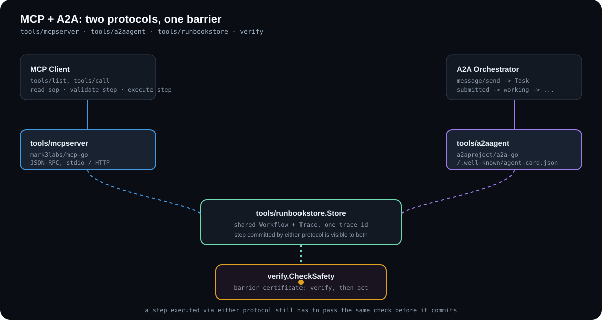

# Agent protocols: MCP, A2A, and the verification barrier

Joltrin runbooks are reachable from two agent protocols, [Model Context Protocol](https://modelcontextprotocol.io/) and [Agent2Agent](https://a2a-protocol.org/), both gated by the same safety-and-reachability check before a step is allowed to commit. Real, tested code (`verify`, `tools/mcpserver`, `tools/a2aagent`; a run with a real agent is recorded in [AGENT_BARRIER_TESTS.md](AGENT_BARRIER_TESTS.md)), not a diagram of an idea; see [MCP, A2A, and the Verification Engine](MCP_A2A_AND_VERIFICATION_ENGINE.md) for the full audit and design writeup.

<p align="center">
  
</p>

**Try the barrier yourself, live: [joltrinhq.com/agents](https://joltrinhq.com/agents/).** GitHub Pages can't run a real MCP or A2A network server (no backend), so this page runs the actual `verify` check compiled to WASM, wired to buttons instead of protocol calls, the same logic those servers call before committing a step. Click "Drop Prod DB" first and watch it block; the trace persists to OPFS, so a reload picks up where you left off. This is a real recording of that page, not a mockup:

<p align="center">
  
</p>

The same scenario also runs as a terminal program, `examples/verify_barrier`, and the servers themselves are one command away:

<p align="center">
  
</p>

```bash
# Run the barrier demo yourself
go run ./examples/verify_barrier

# Serve the same runbook over MCP (stdio)
# Note: this speaks JSON-RPC over stdin/stdout for an MCP client (Claude
# Desktop, an SDK, etc). Run bare in a terminal, it'll print "Parse error"
# for every line you type, since your keystrokes aren't valid JSON-RPC -
# that's expected, not a bug. Point an MCP client at this command instead.
go run ./cmd/sop-mcp-server

# Serve it over A2A instead, then fetch its agent card
go run ./cmd/sop-a2a-agent &
curl localhost:8087/.well-known/agent-card.json

# Claude has no native A2A client, so bridge the two: sop-a2a-bridge
# resolves the agent card above and re-exposes execute_step as an MCP tool
go run ./cmd/sop-a2a-bridge -agent-url http://localhost:8087
```

### Wiring `sop-mcp-server` into Claude

`cmd/sop-mcp-server` speaks JSON-RPC over stdio and evaluates the barrier policies below (`verify`'s `CheckSafety`) before `execute_step` is allowed to commit; a blocked step comes back as `input-required`, not a crash. Point either Claude client at the command:

**Claude Desktop** (`claude_desktop_config.json`, stdio transport):

```json
{
  "mcpServers": {
    "joltrin": {
      "command": "go",
      "args": ["run", "./cmd/sop-mcp-server"],
      "cwd": "/absolute/path/to/joltrin"
    }
  }
}
```

Swap `"command"/"args"` for a prebuilt binary once you've run `go build -o sop-mcp-server ./cmd/sop-mcp-server`:

```json
{
  "mcpServers": {
    "joltrin": {
      "command": "/absolute/path/to/joltrin/sop-mcp-server"
    }
  }
}
```

**Claude Code** (CLI):

```bash
claude mcp add --transport stdio joltrin -- go run ./cmd/sop-mcp-server
```

### Wiring `sop-a2a-agent` into Claude (via `sop-a2a-bridge`)

Claude doesn't speak A2A natively, MCP is the protocol its clients actually implement, so reaching an A2A agent means bridging the two, not writing an A2A client into Claude itself. `tools/a2abridge` is that bridge: an MCP server that resolves a running `sop-a2a-agent`'s card and re-exposes its `execute_step` skill as an MCP tool of the same name, translating each call into a real A2A task delegation over the wire and translating the resulting task state (`completed` / `input-required` / `failed`) back into an MCP tool result. It's built on the official `a2aclient` SDK package, not a hand-rolled JSON-RPC client, and it's covered by its own integration tests (`tools/a2abridge/bridge_test.go`) that drive the full MCP -> bridge -> real A2A wire protocol -> executor round trip, including the blocked, allowed, and remote-failure paths.

Start the agent, then point the bridge at it:

```bash
go run ./cmd/sop-a2a-agent &
go run ./cmd/sop-a2a-bridge -agent-url http://localhost:8087
```

**Claude Desktop:**

```json
{
  "mcpServers": {
    "joltrin-a2a": {
      "command": "go",
      "args": ["run", "./cmd/sop-a2a-bridge", "-agent-url", "http://localhost:8087"],
      "cwd": "/absolute/path/to/joltrin"
    }
  }
}
```

**Claude Code** (CLI):

```bash
claude mcp add --transport stdio joltrin-a2a -- go run ./cmd/sop-a2a-bridge -agent-url http://localhost:8087
```

### Barrier policies `verify` enforces

`verify` is a general-purpose explicit-state precondition/postcondition graph (`Step`, `SafetyRule`, `ReachabilityRule` in `verify/verify.go`) with no built-in notion of databases, clusters, or money. Every state is an opaque string, so a barrier policy for any category of risky action is defined the same way: name the states that must hold, name the step that establishes the dangerous one, and let `CheckSafety` gate it. This repo ships three concrete runbooks in `tools/runbookstore` built on that same generic mechanism, one per risky-action category, plus the generic out-of-order rejection that applies to all of them:

- **Destructive operations** (`DBMaintenanceWorkflow`, e.g. dropping a database): `drop_prod_db` requires `backup_validated`, which only `validate_backup` establishes after `take_backup`. A `SafetyRule` (`no-drop-without-validated-backup`) names the barrier explicitly, and a `ReachabilityRule` guarantees `rollback_complete` stays reachable even after the drop.
- **Resource & topology mutations** (`ClusterTopologyWorkflow`, e.g. draining a node, failing over a cluster): `drain_node` and `failover_cluster` both require `replica_parity_verified`, which requires `health_check_passed` first. Reinstating the node or cluster (`topology_rollback_complete`) stays reachable from every state in the graph, including after a worker is terminated post-drain.
- **Financial / ledger-mutating actions** (`LedgerTransferWorkflow`, e.g. balance updates, account transfers): `commit_transfer` requires `zero_sum_verified`, which only `verify_zero_sum_invariant` establishes after balances are mutated inside a `transaction_serialized` scope (`begin_serializable_transaction` -> `snapshot_balances` -> `apply_debit_credit`). Reversal (`ledger_rollback_complete`) stays reachable both before and after commit.
- **Unverified / out-of-order execution**: this is the same mechanism underlying all three, not a separate check. `CheckSafety` rejects any step whose `Requires` states haven't been established yet in the current `Trace`, and rejects any step that would establish a `Forbidden` state without its paired `Requires` state already holding. An agent (or a client bug) trying to call `drain_node` or `commit_transfer` before its preconditions land gets a named, actionable violation back, never a silent no-op.

Only `DBMaintenanceWorkflow` is registered by the example binaries (`cmd/sop-mcp-server`, `cmd/sop-a2a-agent`) today; `ClusterTopologyWorkflow` and `LedgerTransferWorkflow` are available in `tools/runbookstore` (with tests in `tools/runbookstore/examples_test.go`) as worked examples of modeling the other two categories on the same engine. Register them with `store.RegisterWorkflow` in your own server to serve them.

What this checker is, precisely, matters more than what it sounds like it might be: explicit-state safety and reachability checking over a finite workflow graph, the "P is preceded by Q" precedence pattern from Dwyer/Avrunin/Corbett's property specification patterns (ICSE 1999), not general-purpose LTL/CTL model checking. No formula parser, no Büchi automata, no neural component translating natural language into the graph today. The full accounting of what's built versus proposed is in the linked doc, not summarized rosily here.

## Run the server with memory and your own runbooks

### Let the server remember what blocked

Register it with `--lessons` (it sets `SOP_LESSONS_DIR`, which Claude Code and Codex support; for the Gemini CLI set that variable in its settings file) and the server records each block once per run and tells the next agent when it connects. It also keeps a short `LESSONS.md` there that you can add to a `CLAUDE.md` (`@~/.joltrin/LESSONS.md`) or point an `AGENTS.md` at.

```bash
"$(go env GOPATH)/bin/sop-mcp-server" setup --apply --lessons "$HOME/.joltrin"
```

A blocked `execute_step` also carries the matching lesson in `lesson`, next to `why`, so the agent learns the reason and the order that worked at the moment it is refused. Agents can also ask for the full list with the `read_lessons` tool, which exists only while memory is on. That helps with clients that do not show a server's startup instructions to the model, which the Gemini CLI did not in my test.

`read_lessons` also reports, per runbook, how many runs called `execute_step` and, for each rule, how many runs it blocked and how many of those went on to run every step it had blocked. A rule that blocks many runs and is usually recovered from is being hit early and then followed. A rule that blocks runs that rarely recover is stopping runs that never finished the step. The numbers show how often a rule trips and whether agents get past it, not whether the rule is right.

It is off by default and advice only: the barrier still checks every call, so history never unlocks a step. Lessons name only steps and states from your runbook, and they expire after 30 days or when the runbook changes. Servers that share a folder all keep recording, but each one only sees what the others recorded after it restarts.

### Use your own runbooks

The built-in `db-maintenance` runbook is only an example. Describe your own steps in a JSON file and the barrier enforces them. A step requires states that other steps establish, and a safety rule forbids a state unless another one already holds:

```json
{
  "workflows": {
    "deploy": {
      "steps": [
        {"id": "run_tests",    "establishes": ["tests_passed"]},
        {"id": "get_approval", "requires": ["tests_passed"], "establishes": ["approved"]},
        {"id": "deploy_prod",  "requires": ["tests_passed", "approved"], "establishes": ["deployed"]}
      ],
      "safety": [{"name": "no-deploy-without-approval", "forbidden": "deployed", "requires": "approved"}]
    }
  }
}
```

```bash
"$(go env GOPATH)/bin/sop-mcp-server" setup --apply --runbooks "$PWD/runbooks.json"
```

With a file, the server serves exactly those runbooks. It refuses a file with a typo, such as an unknown field or a state that no step establishes, instead of quietly never blocking anything.

What this catches: an agent that skips a required step, breaks a safety rule, or names a step that does not exist. What it does not do: judge whether an agent's own claim is true. That needs evidence from a tool the agent cannot fake, so it is not something a runbook file can add.
